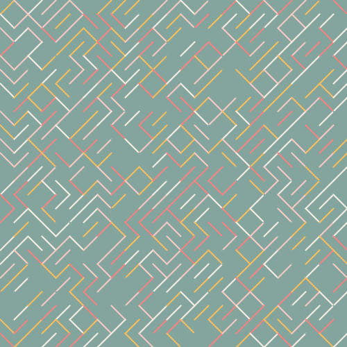
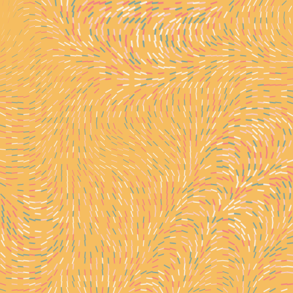
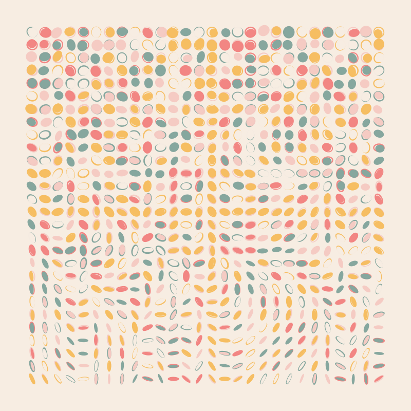
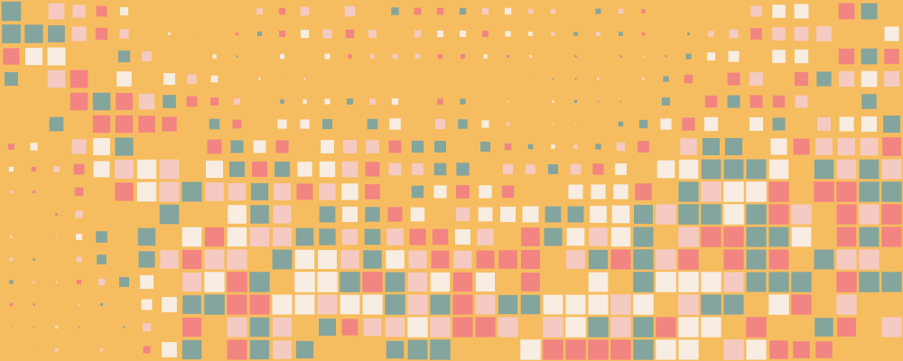
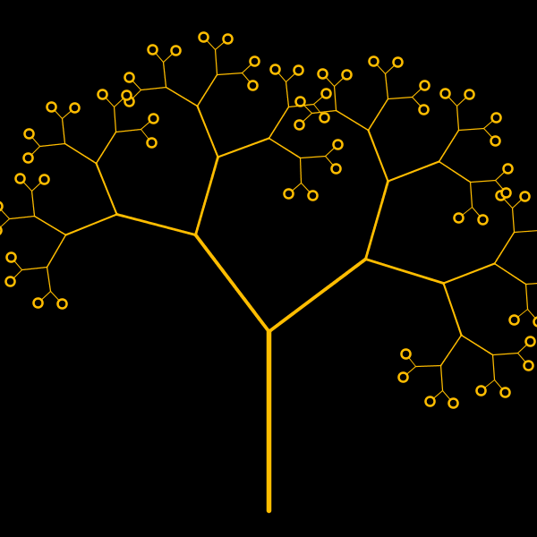
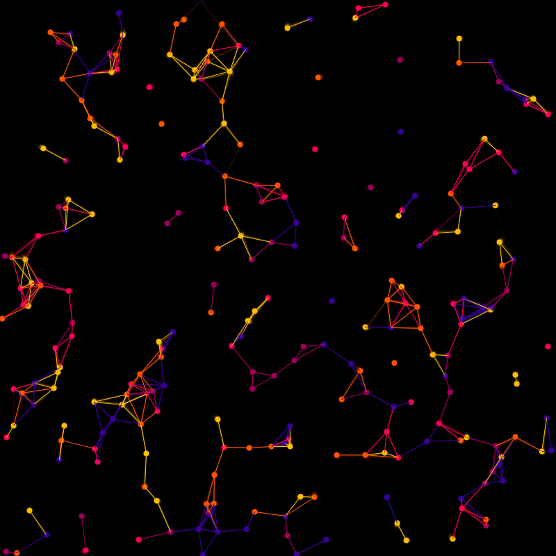
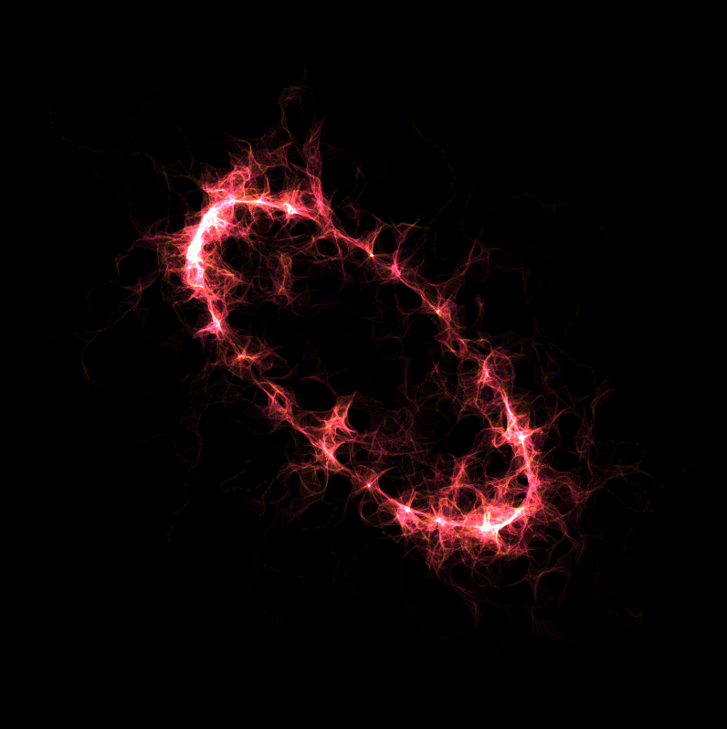

# Generative Algorithms for Art and Design Workshop [2023]
All Processing code templates developed during the Generative Algorithms for Art & Design Workshop, which I taught at the **IDC School of Design**, 
**IIT-Bombay** (from 27th Feb - 4th Mar, 2023). This repository serves as a reference for these basic code templates that
can be used to build up more complex projects and artwork. 

### Contents

#### 1.1 Basic Truchet Tiling

A widely generic spatial-subdivision code, using a basic *Truchet* tiling (or tesselation friendly tiles) consisting of a randomly picked diagonal line for each spatial location. Leads to an interesting maze-like pattern, showing the generative aspect of simple logical operations and repetition.

#### 1.2 Tiling Lines

Instead of tiling, we now draw short lines at each subdivision point in space, leading to a more "flow" like aesthetic. 

Note: *This is also the first step towards building a digital/analogue display, where the spatial variation encodes some information.*

#### 1.3 Tiling Ellipses

Instead of lines, we use the same idea to draw ellipses. Since monotonous 
ellipses might not be too interesting, we add a simple variations - circles 
transitioning into ellipses as we move down in space. This adds **dimensionality** 
to the work. As a further effect, we add a "drop-shadow" like stroke effect
to give the work a more painterly feel.

#### 1.4 Blink 

An example showing how adding a phase difference between space-filling shapes
can lead to a display-like behaviour, as well as show larger scale dynamics.

#### 2.1 Recursive Tree

A fractal tree algorithm using recursion. Also demonstrates how to 
vary parameters (a) for making a perfect loop and (b) using mouse controls.

#### 3.1 Particle System - Connections

A particle system, with smooth motion through space. Connecting particle
pairs within a given distance. The same system can be modified to add more
intricate dynamics, physical forces or be used as a drawing agent as shown in the 
next sketch.

#### 3.2 Particle System - as an Artist

Using the particle system as a drawing agent, by connecting lines between 
closeby particles and moving them. The initial location of the particles
can be used to trace out geometric (or typographical) shapes. Using the **blendMode(ADD)**
gives a nice glowing effect to the trailing wisps of connected particles.

Note: *The random initialization of the starting shape function gives rise to a new piece each time. You may try to encode
alphabet contours or other shapes using parametric curves.*

#### 4 Visualizer for Trigonometric Functions

A visualizer for trigonometric functions like sin, cos and tan, and their combinations.
Serves as a reference to test the dynamics and spatial distribution coded using these functions.

#### 5 Mic Input

A minimal example showing how you can use the microphone input to set certain sketch parameters to add interactivity.
